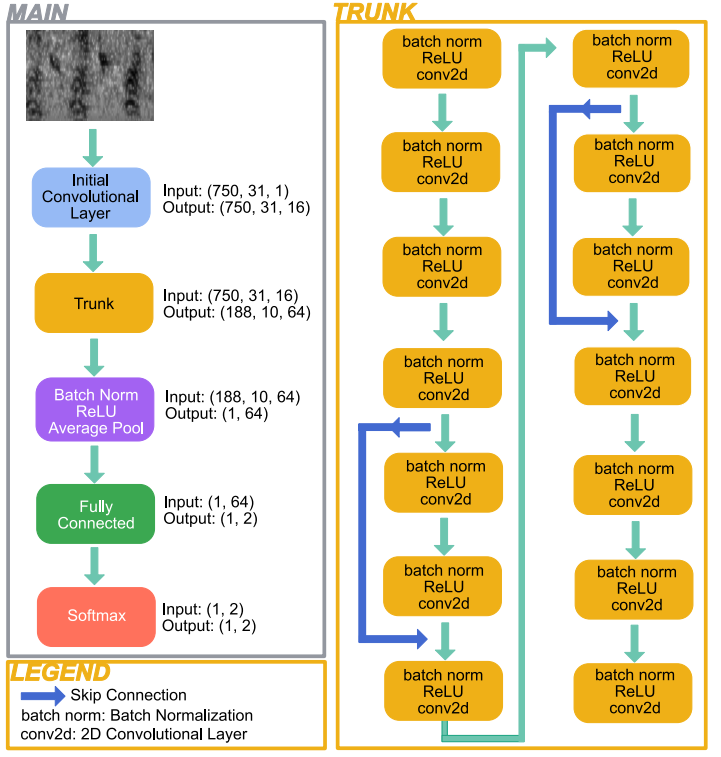

# About

## Ringed seals

Ringed seals are a species of Arctic seal which are strongly dependent on sea ice. The sea ice 
is thinning and forming later each year, and ringed seals are a species of special concern in Canada
due to projected habitat loss. They are also the primary prey for polar bears and an important species to 
indigenous communities in the Arctic. Passive acoustic monitoring (PAM)
is used to collect year-round acoustic data containing vocalizations of vocally-active marine mammals.
The analysis of PAM data can provide insights into a species' spatial and temporal distributions,
which can be used to create effective conservation measures to combat species 
decline due to the effects of climate change. 

## Why is it useful?

Manual analysis of PAM data is prohibitively time-consuming and costly. We are now able to collect
large volumes of data at a rate faster than manual analysis is possible, and manual analysis is biased
by an annotators perspective and fatigue levels. These reasons have motivated the development of 
automated detection methods. Recently, deep learning methods have begun to outperform more traditional
methods (such as spectrogram correlation or matched filtering). This detector makes it feasible to 
analyze the large volumes of PAM data being collected each year for ringed seal vocalizations.

## What environments does it work in? 

The detector was trained using data from the Western Canadian Arctic, and was evaluated
extensively in the region.

## How does it work? 

The detector can be applied to audio data through the use of the command line interface (see
[Set Up & Run](SetUp.md) for more instructions). The model architecture of the detector 
is ``ResNet", a popular convolutional neural network architecture. 

In the background, the detector performs the following steps: 

1. The audio is split into 1-s segments using 50% overlap
2. The 1-s segments are converted into spectrogram representation
3. The spectrograms are passed through the trained models, which output a score for if that
spectrogram contained a ringed seal vocalization or not
4. The median score of all models is used for that segment
5. If segments next to each other or overlapping have the same prediction 
(both are predicted to contain a vocalization), the detections are merged taking 
the median of their scores 
6. Detections are filtered to only display positive predictions, or time segments which have
been predicted to contain a ringed seal vocalization
7. A confidence threshold is applied to remove detections with scores below this threshold from
the list (the default is 0.5)

## Requirements 

This tutorial uses Python version 3.9.17 and Ketos version 2.7.0. 
The output files were tested with Raven Pro 1.60.

## Contributors

Karlee Zammit is the lead developer on this project, in collaboration with 
William Halliday (WCS) and Stan Dosso (UVic). 

### Marine Bioacoustician Annotators 
Mariana Barbosa, William Halliday, Nikoletta Diogou, Chloe Nicholls, Amalis Riera, 
Cierra Hart, and Rosana Soares,

### Data Collectors and Local Community Partners 
Roy Inuktalik, Tony Alanak, Adam Kudlak, Shane Alikamik, Annika Heimrich, H. Melling, 
K. Borg, William Halliday, the captain and crew of the CCGS Sir Wilfrid Laurier, and the
Olokhaktomiut Hunters and Trappers Committee

