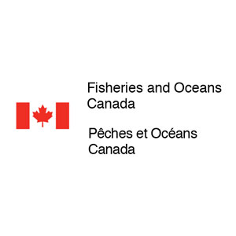

# Credits

This project was completed at the University of Victoria (British Columbia, Canada) under supervision of S. E. Dosso and W. Halliday.

The project was funded by Mitacs, Wildlife Conservation Society Canada, and Fisheries and Oceans Canada. Data was provided by Wildlife Conservation Society Canada.

Main contact: Karlee Zammit, kzammit@uvic.ca

