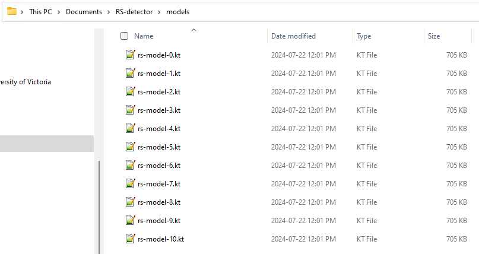
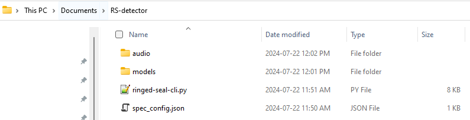
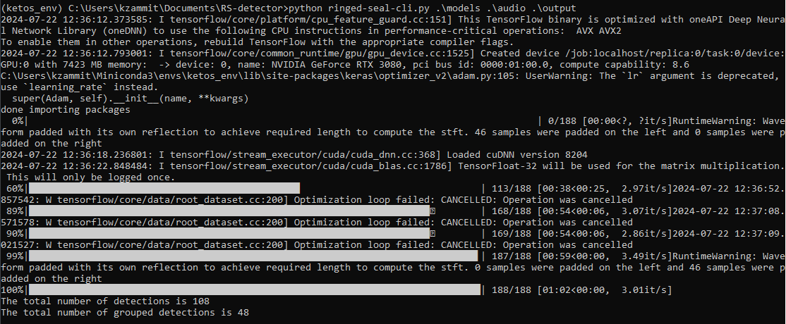

# Set Up & Run

## Overview 

This tutorial uses Python version 3.9.17 and Ketos version 2.7.0. The output files were tested with Raven Pro 1.60.

## Installation Steps 

1. Install [Anaconda](https://docs.anaconda.com/anaconda/install/windows/) or [Miniconda](https://docs.anaconda.com/miniconda/). Miniconda installs only the necessary packages and is smaller than Anaconda, but Anaconda can be more beginner-friendly if you are planning to continue using Python in the future.
2. Open the Anaconda Prompt
3. Create a Python environment (called RS_env in this example) using the command: 

```commandline
conda create -n RS_env python=3.9.17
```

4. Activate your environment: 

```commandline
conda activate RS_env
```

5. Install ketos version 2.7.0: 

```commandline
pip install ketos=2.7.0
```

This may take a few minutes. Note the below error message if you run into issues with Numpy versioning.

!!! note

    ⚠️ **If you are already a Python user**: Some users experienced issues with NumPy versioning. If you have errors (example: loading NDarray), force install NumPy version 1.24.4 in your detector environment.
    
    Type (with your environment activated): pip install numpy==1.24.4

6. Navigate to the [ringed seal detector repository](https://github.com/karlzam/ringed-seal-detector/tree/main) on GitHub

7. Download the following files and place them in a directory of your choice: 
    1. ringed-seal-cli.py
    2. config\spec_config.json
   3. config\models.zip

5. Unzip the models.zip file and place in a folder called "models". There should be 10 ".kt" files within the folder:



6. Place your audio files within a folder called "audio". Your directory should look like this: 



If you don't have audio files of your own, or you'd like to test the detector before running on your own data, a subsample of audio files have been provided in the "audio.zip" folder on GitHub. 

## Run the Detector

1. In the Anaconda prompt (with your environment activated), navigate into your directory:

```commandline
cd C:\Users\kzammit\Documents\RS-detector
```

!!! note

    To open the help dialog for the command line interface, type: 
   
      "python ringed-seal-cli.py -h"

      This will outline the positional and optional arguments. See [Usage](Usage.md) for more information.


**2. To run the detector, type:** 

```commandline
python ringed-seal-cli.py .\models .\audio .\output
```

## Output Files

In the output folder, there will be two files: 

1. "detections-filtered-and-grouped.xlsx": An Excel sheet which includes the filename, start time, end time, label, and score for a detection.

2. "raven-formatted-detections.txt": The detections formatted for use in Raven Pro 1.60. This file can be loaded as a "Sound Selection File" which automatically loads the audio files with detections placed on top. 

## Run with Example Audio Files

[Example audio files](https://github.com/karlzam/ringed-seal-detector/blob/main/config/audio.zip) have been provided to test the detector with your set-up and to explore the output files. Extract these from the zip file and place in your audio folder as described above. 

Below is an example of output for a working detector run: 



At the bottom there are two sentences: 

1. "The total number of detections is 108": These are the total number of detections above the defined threshold (default is 0.5) with no merging.
2. "The total number of grouped detections is 48": These are the merged detections. If multiple 1-s windows beside each other or overlapping with each other had the same classification, the post-processing merges these into one detection of variable length. 

The two output files will be in the output folder (as explained above), and the text file for use in Raven uses the merged detections.
