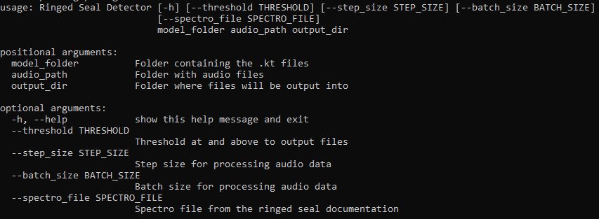

# Set Up

## Overview 

This tutorial uses Python version 3.9.17 and Ketos version 2.7.0. The output files were tested with Raven Pro 1.60.

## Installation Steps 

1. Install [Anaconda](https://docs.anaconda.com/anaconda/install/windows/) or [Miniconda](https://docs.anaconda.com/miniconda/). Miniconda installs only the necessary packages and is smaller than Anaconda, but Anaconda can be more beginner-friendly if you are planning to continue using Python in the future.
2. Open the Anaconda Prompt
3. Create a Python environment (called RS_env in this example) using the command: 

```commandline
conda create -n RS_env python=3.9.17
```

4. Activate your environment: 

```commandline
conda activate RS_env
```

5. Install ketos version 2.7.0: 

```commandline
pip install ketos=2.7.0
```

This may take a few minutes. Note the below error message if you run into issues with Numpy versioning.

!!! note

    ⚠️ **If you are already a Python user**: Some users experienced issues with NumPy versioning. If you have errors (example: loading NDarray), force install NumPy version 1.24.4 in your detector environment.
    
    Type (with your environment activated): pip install numpy==1.24.4

6. Navigate to the [ringed seal detector repository](https://github.com/karlzam/ringed-seal-detector/tree/main) on GitHub

7. Download the following files and place them in a directory of your choice: 
    1. ringed-seal-cli.py
    2. config\spec_config.json
   3. config\models.zip

5. Unzip the models.zip file and place in a folder called "models". There should be 10 ".kt" files within the folder:


6. Place your audio files within a folder called "audio". Your directory should look like this: 


7. In the Anaconda prompt (with your environment activated), navigate into your directory:

```commandline
cd C:\Users\kzammit\Documents\RS-detector
```
8. Open the help dialog for the command line interface: 

```commandline
python ringed-seal-cli.py -h 
```

It should output several lines (which can vary if a user does or does not have a GPU) ending with :



The positional arguments are required to run the command line interface, and the optional arguments are for more advanced users. See [Usage](Usage.md) for more information.

**9. To run the detector, type:** 

```commandline
python ringed-seal-cli.py .\models .\audio .\output
```
