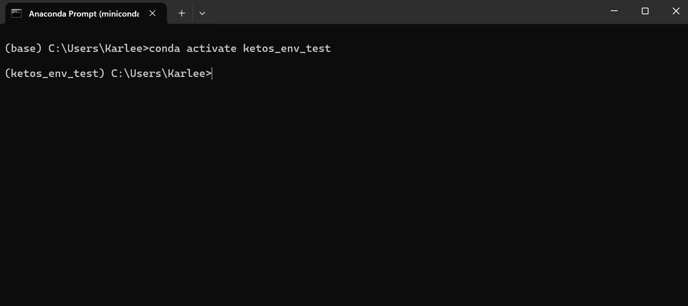

# Tutorial

!!! note

    This page assumes you have already read and completed the "set up" page.

1. Navigate into the Anaconda prompt 
2. Activate the environment you created to run the detector (ex. called "detector_env")

```commandline
conda activate detector_env
```
:warning: **If you are already a Python user**: Be very careful here!


