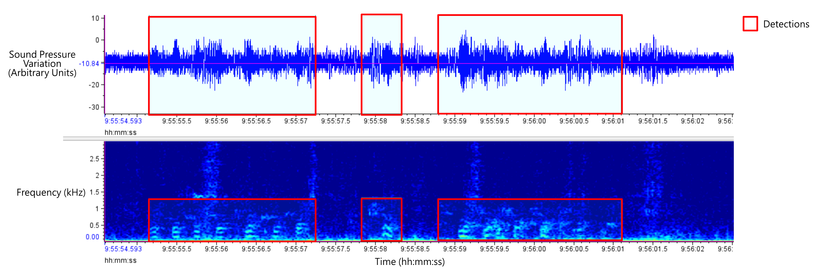

{!README.md!}

The ringed seal detector is an open-source tool for detecting ringed seal barks within 
passive acoustic data. It was trained using data from the Western Canadian Arctic, and 
focuses on the 100-1200 Hz (low frequency) range. Detection outputs are compatible with 
[Raven Sound Analysis Software](https://www.ravensoundsoftware.com/). 

The detector was written in Python, and requires Anaconda (or Miniconda) to run. 
The detector uses the [Ketos](https://docs.meridian.cs.dal.ca/ketos/introduction.html) Python package extensively.

Please see the [Set Up](SetUp.md) page to get started.

[GitHub Repository](https://github.com/karlzam/ringed-seal-detector/tree/main)

The data collection for this detector took place in the Inuvialuit Settlement Region. 
We are grateful to the Inuvialuit and Inuit for help with data collection, and for allowing 
this research to be conducted in their traditional lands. Koana, quyanainni, thank you.

The development of this detector took place in the traditional lands of the Lekwungen 
people, who we acknowledge and respect and whose historical relationships with the land 
continue to this day.

